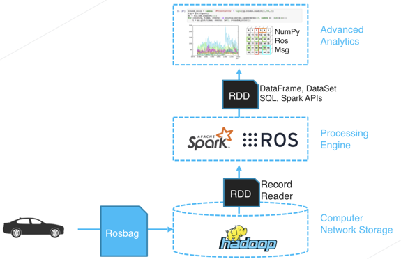
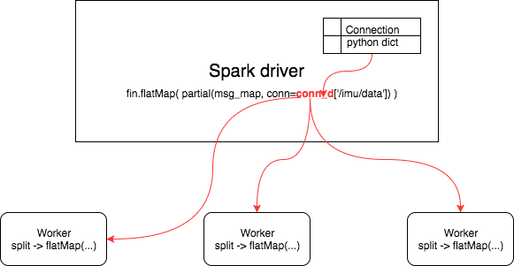
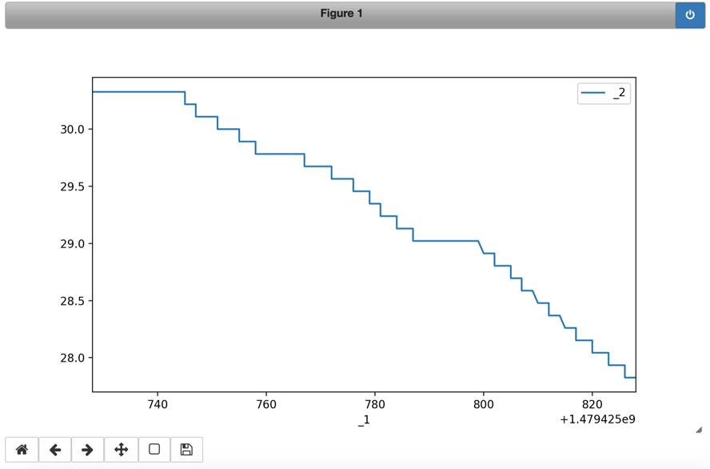
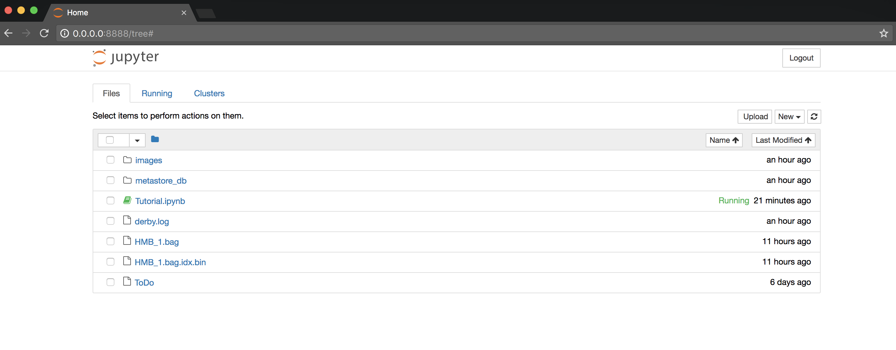

# **RosbagInputFormat**
RosbagInputFormat is an open source **splittable** Hadoop InputFormat for the ROS bag file format.

The complete source code is available in src/ folder and the jar file is generated using SBT (see build.sbt)

For an example of rosbag file larger than 2 GB see doc/Rosbag larger than 2 GB.ipynb Solved the issue https://github.com/valtech/ros_hadoop/issues/6 The issue was due to ByteBuffer being limitted by JVM Integer size and has nothing to do with Spark or how the RosbagMapInputFormat works within Spark. It was only problematic to extract the conf index with the jar.

# Usage

1. Download latest release jar file and put it in classpath
2. Extract the index configuration of your ROS bag file. **The extracted index is a very very small configuration** file containing a protobuf array that will be given in the job configuration. **Note that the operation will not process and it will not parse** the whole bag file, but will simply seek to the required offset. e.g.
```bash
java -jar lib/rosbaginputformat.jar -f /opt/ros_hadoop/master/dist/HMB_4.bag
# will create an idx.bin config file /opt/ros_hadoop/master/dist/HMB_4.bag.idx.bin
```
3. Put the ROS bag file in HDFS e.g.
```bash
hdfs dfs -put
```
4. Use it in your Spark jobs e.g.
```python
sc.newAPIHadoopFile(
    path =             "hdfs://127.0.0.1:9000/user/spark/HMB_4.bag",
    inputFormatClass = "de.valtech.foss.RosbagMapInputFormat",
    keyClass =         "org.apache.hadoop.io.LongWritable",
    valueClass =       "org.apache.hadoop.io.MapWritable",
    conf = {"RosbagInputFormat.chunkIdx":"/opt/ros_hadoop/master/dist/HMB_4.bag.idx.bin"})
```

Example data can be found for instance at https://github.com/udacity/self-driving-car/tree/master/datasets published under MIT License.

# Documentation
The [doc/](doc/) folder contains a jupyter notebook with a few basic usage examples.

<p align="center">
</p>

# Tutorial

## To test locally use the Dockerfile

To build an image using the Dockerfile run the following in the shell.
Please note that it will download Hadoop and Spark from the URL source. The generated image is therefore relatively large ~5G.
```bash
docker build -t ros_hadoop:latest -f Dockerfile .
```

To start a container use the following shell command **in the ros_hadoop folder.**
```bash
# $(pwd) will point to the ros_hadoop git clone folder
docker run -it -v $(pwd):/root/ros_hadoop -p 8888:8888 ros_hadoop
```
The container has a configured HDFS as well as Spark and the RosInputFormat jar.
It leaves the user in a bash shell.

Point your browser to the local [URL](http://localhost:8888/) and enjoy the tutorial. The access token is printed in the docker container console.

### Usage from Spark (pyspark)

Example data can be found for instance at https://github.com/udacity/self-driving-car/tree/master/datasets published under MIT License.

Check that the Rosbag file version is V2.0

```bash
java -jar lib/rosbaginputformat.jar --version -f /opt/ros_hadoop/master/dist/HMB_4.bag
```

### Extract the index as configuration

The index is a very very small configuration file containing a protobuf array that will be given in the job configuration.
Note that the operation will not process and it will not parse the whole bag file, but will simply seek to the required offset.

```bash
# assuming you start the notebook in the doc/ folder
java -jar ../lib/rosbaginputformat.jar \
     -f /opt/ros_hadoop/master/dist/HMB_4.bag

hdfs dfs -ls
```

This will generate a very small file named HMB_4.bag.idx.bin in the same folder.

### Copy the bag file in HDFS

Using your favorite tool put the bag file in your working HDFS folder.

***Note***: keep the index file as configuration to your jobs, ***do not*** put small files in HDFS.
For convenience we already provide an example file (/opt/ros_hadoop/master/dist/HMB_4.bag) in the HDFS under /user/root/

```bash
hdfs dfs -put /opt/ros_hadoop/master/dist/HMB_4.bag
hdfs dfs -ls
```
<p align="center">
</p>

+ Hadoop InputFormat and Record Reader for Rosbag
+ Process Rosbag with Spark, Yarn, MapReduce, Hadoop Streaming API, …
+ Spark RDD are cached and optimised for analysis

### Process the ROS bag file in Spark using the RosbagInputFormat

***Note***: your HDFS address might differ.
```python
fin = sc.newAPIHadoopFile(
    path =             "hdfs://127.0.0.1:9000/user/root/HMB_4.bag",
    inputFormatClass = "de.valtech.foss.RosbagMapInputFormat",
    keyClass =         "org.apache.hadoop.io.LongWritable",
    valueClass =       "org.apache.hadoop.io.MapWritable",
    conf = {“RosbagInputFormat.chunkIdx”:”/opt/ros_hadoop/master/dist/HMB_4.bag.idx.bin"})
```

### Interpret the Messages

To interpret the messages we need the connections.
We could get the connections as configuration as well. At the moment we decided to collect the connections into Spark driver in a dictionary and use it in the subsequent RDD actions.

Collect the connections from all Spark partitions of the bag file into the Spark driver
```python
conn_a = fin.filter(
			lambda r: r[1]['header']['op'] == 7
		).map(
			lambda r: r[1]
		).collect()
conn_d = {str(k['header']['topic']):k for k in conn_a}

# see topic names
conn_d.keys()
```

From all ROS bag splits we collect into Spark driver the connection messages (op=7 in header) where the ROS definitions are stored. This operation happens in parallel of course.

### Load the python map functions from src/main/python/functions.py
```bash
%run -i ../src/main/python/functions.py
```
At the moment the file contains a single mapper function named msg_map.

### Use of msg_map to apply a function on all messages

Python rosbag.bag needs to be installed on all Spark workers. The msg_map function (from src/main/python/functions.py) takes three arguments:
	1.	r = the message or RDD record Tuple
	2.	func = a function (default str) to apply to the ROS message
	3.	conn = a connection to specify what topic to process

```python
%matplotlib nbagg
# use %matplotlib notebook in python3
from functools import partial
import pandas as pd
import numpy as np


# Take messages from '/imu/data' topic using default str func
rdd = fin.flatMap(
    partial(msg_map, conn=conn_d['/imu/data'])
)
```

The connection dictionary is sent over the closure to the workers that uses it in the msg_map.

<p align="center"></p>

```python
print(rdd.take(1)[0])
```

```
header:
  seq: 1701626
  stamp:
    secs: 1479425728
    nsecs: 747487068
  frame_id: /imu
orientation:
  x: -0.0251433756238
  y: 0.0284643176884
  z: -0.0936542998233
  w: 0.994880191333
orientation_covariance: [0.017453292519943295, 0.0, 0.0, 0.0, 0.017453292519943295, 0.0, 0.0, 0.0, 0.15707963267948966]
angular_velocity:
  x: 0.0
  y: 0.0
  z: 0.0
angular_velocity_covariance: [-1.0, -1.0, -1.0, -1.0, -1.0, -1.0, -1.0, -1.0, -1.0]
linear_acceleration:
  x: 1.16041922569
  y: 0.595418334007
  z: 10.7565326691
linear_acceleration_covariance: [0.0004, 0.0, 0.0, 0.0, 0.0004, 0.0, 0.0, 0.0, 0.0004]
```


### Image data from camera messages

An example of taking messages using a func other than default str.
In our case we apply a lambda to messages from from '/center_camera/image_color/compressed' topic. As usual with Spark the operation will happen in parallel on all workers.

```python
from PIL import Image
from io import BytesIO

res = fin.flatMap(
    partial(msg_map, func=lambda r: r.data, conn=conn_d['/center_camera/image_color/compressed'])
).take(50)

Image.open(BytesIO(res[48]))
```

<p align="center"></p>


### Plot fuel level

The topic /vehicle/fuel_level_report contains 2215 ROS messages. Let us plot the header.stamp in seconds vs. fuel_level using a pandas dataframe.

```python
def f(msg):
    return (msg.header.stamp.secs, msg.fuel_level)

d = fin.flatMap(
    partial(msg_map, func=f, conn=conn_d['/vehicle/fuel_level_report'])
).toDF().toPandas()

d.set_index(‘_1').plot()
```
<p align="center"></p>

### Machine Learning models on Spark workers

A dot product Keras "model" for each message from a topic. We will compare it with the one computed with numpy.

***Note*** that the imports happen in the workers and not in driver. On the other hand the connection dictionary is sent over the closure.

```python
def f(msg):
    from keras.layers import dot, Dot, Input
    from keras.models import Model

    linear_acceleration = {
        'x': msg.linear_acceleration.x,
        'y': msg.linear_acceleration.y,
        'z': msg.linear_acceleration.z,
    }

    linear_acceleration_covariance = np.array(msg.linear_acceleration_covariance)

    i1 = Input(shape=(3,))
    i2 = Input(shape=(3,))
    o = dot([i1,i2], axes=1)

    model = Model([i1,i2], o)

    # return a tuple with (numpy dot product, keras dot "predict")
    return (
        np.dot(linear_acceleration_covariance.reshape(3,3),
               [linear_acceleration['x'], linear_acceleration['y'], linear_acceleration['z']]),
        model.predict([
            np.array([[ linear_acceleration['x'], linear_acceleration['y'], linear_acceleration['z'] ]]),
            linear_acceleration_covariance.reshape((3,3))])
    )

fin.flatMap(partial(msg_map, func=f, conn=conn_d['/vehicle/imu/data_raw'])).take(5)

# tuple with (numpy dot product, keras dot “predict”)
```
One can sample of course and collect the data in the driver to train a model on one single machine.
Note that the msg is the most granular unit but you could replace the flatMap with a mapPartitions to apply such a Keras function to a whole split.

Another option would be to have a map.reduceByKey before the flatMap so that the function argument would be a whole interval instead of a msg. The idea is to key on time.

We hope that the RosbagInputFormat would be useful to you.

## Please do not forget to send us your [feedback](AUTHORS).

